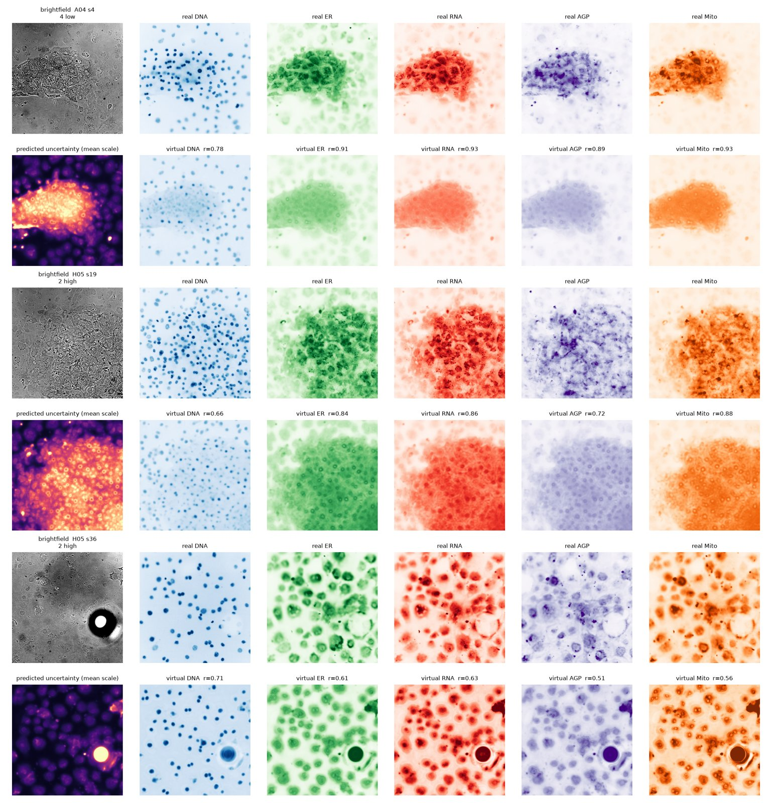

# VirtualPaint-Tox

**Label-free virtual Cell Painting with pixel-wise uncertainty for non-destructive toxicity readouts in liver microphysiological systems.**

Entry for the Kaggle hackathon [AI4S Open Innovation: AI for Life Science](https://www.kaggle.com/competitions/ai-4-s-open-innovation-artificial-intelligence-for-life-scien) (5th Pazhou Algorithm Competition). Category: **Model & Algorithm**.

Cell Painting stains five cellular compartments with fluorescent dyes and is the workhorse morphological assay in toxicology, but staining is terminal: the tissue cannot be imaged again. Organ-on-chip and microphysiological systems (MPS) are expensive and long-lived, so labs want non-destructive, repeatable readouts. VirtualPaint-Tox learns to predict the five Cell Painting channels (DNA, ER, RNA, AGP, Mito) from a plain **brightfield** image of a **liver MPS** (OASIS HepatoPAC primary-hepatocyte co-culture), reports a **per-pixel uncertainty** so users know where the virtual stain can be trusted, and tests whether the virtual stain carries the same *toxicological* information as the real one (nuclear counts, treatment-effect detection, compound identification).



## Data (public, CC0, no credentials)

All images come from the [Cell Painting Gallery](https://github.com/broadinstitute/cellpainting-gallery) on the AWS Registry of Open Data (`s3://cellpainting-gallery`, CC0 1.0):

| Dataset | System | What we use | Size |
|---|---|---|---|
| `cpg0037-oasis/hepatopac` | HepatoPAC micropatterned primary human hepatocyte / stromal co-culture (liver MPS), Opera Phenix 20x | Islands scan: 48 wells x 49 fields, brightfield + DNA/ER/RNA/AGP/Mito; 5 anonymised compounds at 2 doses + 8 vehicle controls | 14,112 TIFFs, 33 GB |
| `cpg0037-oasis/axiom` | U2OS, Operetta, 1,085 compounds x 8 doses with per-well MTT/LDH cytotoxicity | targeted subset of wells (see `docs/`) | see docs |

The scripts download exactly what is needed over HTTPS (`python -m vptox.download`). Raw data is never committed; the well-level split we used is committed in `meta/hepatopac/manifest.csv`.

## Install

```bash
uv venv --python 3.12 .venv && source .venv/bin/activate      # or: python3.12 -m venv .venv
uv pip install -r requirements.txt && uv pip install -e .      # or: pip install -r requirements.txt -e .
```

Tested on macOS (Apple Silicon, PyTorch MPS) with 4 CPU threads and 16 GB RAM; also runs on CPU or CUDA (`--device`).

## Reproduce

```bash
python run_all.py --quick      # ~20 min smoke test: 6 wells x 8 fields, 40 optimizer steps, all stages
python run_all.py              # full run: download (33 GB) -> manifest -> preprocess -> train 7 models -> evaluate -> downstream -> figures
python run_all.py --stage eval,downstream,figures   # re-run late stages on existing checkpoints
```

Stages and their scripts (each is also a standalone CLI, `python -m vptox.<module> --help`):

| Stage | Module | Output |
|---|---|---|
| download | `vptox.download` | `data/hepatopac/islands/*.tiff`, `data/hepatopac/meta/` |
| manifest | `vptox.manifest` | field-level manifest with a **well-level** train/val/test split (29/7/12 wells) |
| preprocess | `vptox.preprocess` | `(6,H,W)` uint16 stacks (2x block-averaged, 1.19 um/px) + normalisation stats |
| train | `vptox.train` | `results/hepatopac/<experiment>/{best.pt,log.csv,done.json}` |
| eval | `vptox.predict` | per-field metrics, calibration, virtual stains (`pred/*.npy`) |
| downstream | `vptox.downstream` | nuclei agreement, feature fidelity, treatment-effect concordance, classifiers |
| figures | `vptox.figures` | `results/hepatopac/figures/*.png`, `results_table.md` |

Experiments trained by `run_all.py` (`EXPERIMENTS` dict): `unet` (ours: U-Net + Laplace uncertainty head, 5,000 steps), `unet_nounc` (L1 only), `unet_ssim` (+SSIM), `smallcnn`, `linear` (per-pixel), `unet_frac25`, `unet_frac50` (training-set size). Ablations use 1,500 steps of batch 16 x 256^2 crops.

Trained checkpoints are small (31 MB each) and are published as assets of the GitHub release `v1.0-checkpoints`; `python run_all.py --stage eval,downstream,figures` fetches them automatically (`python -m vptox.checkpoints --dataset hepatopac --experiments unet,linear,...`) and reproduces every number in the report without training.

## Results (HepatoPAC, 12 held-out wells / 588 fields)

| Channel | DNA | ER | RNA | AGP | Mito | mean |
|---|---|---|---|---|---|---|
| Pearson r (U-Net + uncertainty, ours) | 0.73 | 0.77 | 0.85 | 0.73 | 0.85 | 0.79 |
| SSIM | 0.74 | 0.67 | 0.73 | 0.67 | 0.76 | 0.71 |
| Spearman(predicted scale, abs. error) | 0.49 | 0.59 | 0.62 | 0.54 | 0.63 | |

Downstream, with the same label-free pipeline on virtual and real stains: nuclei per field r = 0.71; 67% of 49 interpretable features reproduced with r > 0.7 (median 0.81); compound-effect ranking across treated wells Spearman 0.55. Full tables, baselines, ablations, calibration and the Axiom U2OS cytotoxicity experiment are in the technical report (`docs/report/report.pdf`).

## Inference on your own brightfield image

```bash
python -m vptox.predict_image --checkpoint results/hepatopac/unet/best.pt --input my_brightfield.tif --out out/
```

Writes the five virtual channels, the per-channel uncertainty maps and an RGB overlay. Input should be a 20x brightfield image at ~1.2 um/px (2x2-binned Opera Phenix 20x, block-averaged 2x); other magnifications need re-training.

## Repository layout

```
run_all.py            entry script (all stages, --quick smoke test)
src/vptox/            package (see table above)
meta/hepatopac/       committed platemap + manifest with the split used in the report
docs/                 technical report (LaTeX + PDF), figures, video script
results/              produced by run_all.py (large artefacts gitignored)
reference/            competition pages
```

## Licence and attribution

Code: MIT. Data: Cell Painting Gallery, CC0 1.0. Please cite the OASIS Consortium dataset `cpg0037-oasis`, the Cell Painting Gallery (Weisbart et al., *Nature Methods* 2024) and acknowledge the AWS Open Data Sponsorship Program. See the technical report for the full list of third-party software and datasets.
